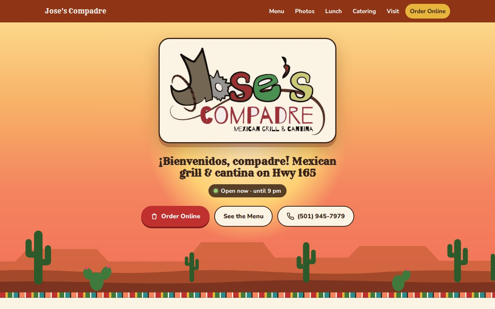
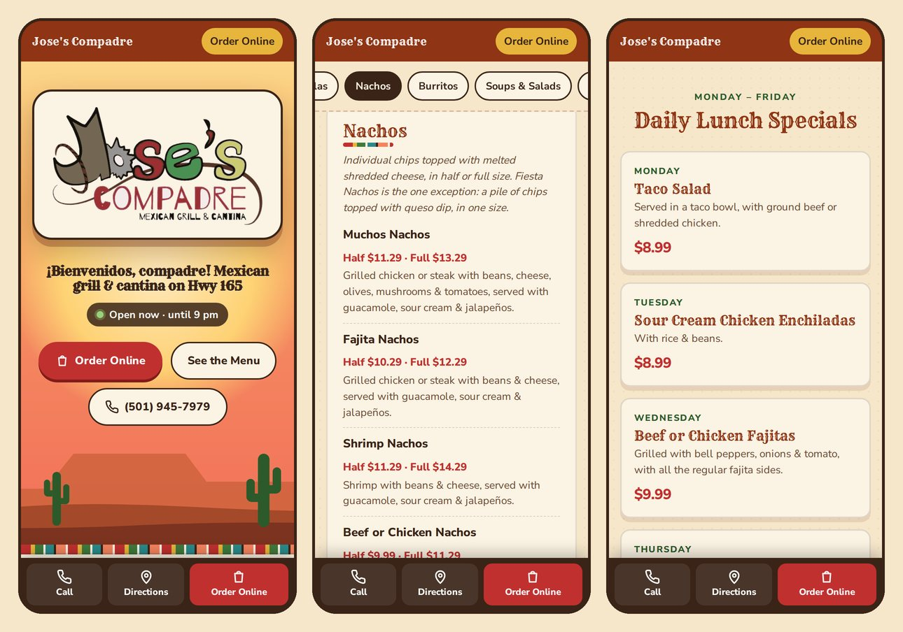
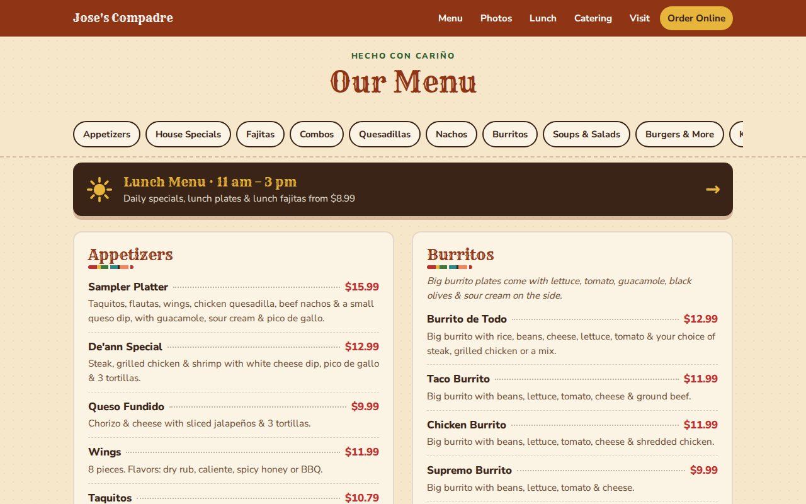
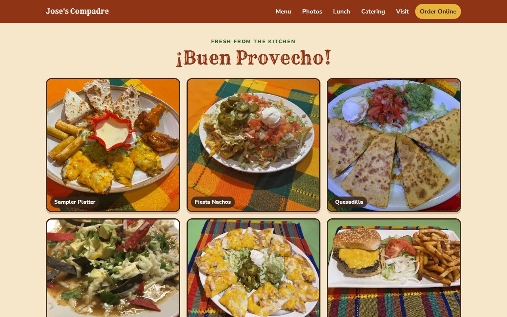

# Jose's Compadre Mexican Grill: Restaurant Website

**Live site: [josescompadre.com](https://josescompadre.com)**

A mobile-first website for Jose's Compadre Mexican Grill & Cantina, a family-owned restaurant in North Little Rock, Arkansas. It replaced the restaurant's paid Squarespace site. It now runs on free GitHub Pages hosting with a custom domain through Cloudflare, so the only ongoing cost is about $10 a year for the domain.



---

## The problem

The old Squarespace site had a monthly fee and several problems:
- The menu was posted only as photos of the printed menu. Customers couldn't search it, it was hard to read on a phone, and it wasn't visible to search engines.
- The phone number link didn't call the restaurant.
- The menu page's browser tab was titled "Contact."
- The prices online didn't always match the printed menu or the online ordering system.

## What I built

| Feature | Details |
|---|---|
| **Full text menu** | 136 items in 13 sections, including item descriptions, size options (half/full, small/large) and add-ons |
| **Lunch page** | Its own page at `/lunch` with lunch plates, lunch fajitas and five daily specials. Today's special is highlighted automatically based on Central time. |
| **Catering** | Six per-person catering packages, with the order minimum and what's included |
| **One-tap actions** | Call, Directions and Order Online buttons stay pinned to the bottom of the screen on phones |
| **Open/closed badge** | Shows "Open now" or "Opens at 11 am" live, using the restaurant's time zone rather than the visitor's |
| **Photo gallery** | 13 photos of the food and the restaurant, compressed to WebP (about 50 KB each) and lazy-loaded |
| **Map with fallback** | An embedded Google Map. If it can't load, a styled card with the address and a Maps link shows instead. |
| **Online ordering** | Links to the restaurant's existing Toast online ordering, so nothing changed for the kitchen |
| **SEO** | `schema.org` Restaurant data (hours, address, phone), meta descriptions and clean URLs |

<p align="center"></p>

## Design

The owners asked for a design that matches the restaurant's Mexican style. I went with a desert sunset theme:
- A hand-drawn SVG landscape with mesas, saguaro cacti and prickly pear across the top of the page
- Serape-stripe dividers made in CSS, with no image files
- Western display headings (Rye) with clean body text (Nunito Sans)
- The restaurant's own logo, with its background removed so it sits on the new design





## How it works

The site is plain HTML, CSS and a small amount of JavaScript. It has no framework and no build server, so it loads fast and can be hosted for free.

The menu lives as data in one Python file. A short build script turns that data into the finished pages, so a price change is a one-line edit instead of hand-editing HTML.

```
build.py        Menu, lunch and catering data, plus the page generator
template.html   Page layout, styles and scripts
index.html      Main page (generated)
lunch.html      Lunch page (generated, served at /lunch)
photo-*.webp    Optimized photos
```

To update a price:
```bash
# 1. Edit the item in build.py, e.g. ("Taco Salad", "10.29", "...")
python3 build.py        # 2. Rebuilds index.html and lunch.html
# 3. Upload the two pages to GitHub. The live site updates in about a minute.
```

## Deployment and infrastructure

- **Hosting:** GitHub Pages, deployed from the `main` branch
- **Domain:** registered with Cloudflare Registrar at cost
- **DNS:** four `A` records pointing the apex domain at GitHub's Pages servers, and a `CNAME` for `www`. All are set to *DNS only* so GitHub can issue the TLS certificate.
- **HTTPS:** enforced with a GitHub-issued certificate
- **Clean URLs:** `/lunch` instead of `/lunch.html`, and a small script tidies old `.html` links in the address bar

## Working with the business

This was a real project for a real client, my family's restaurant, where I've worked since 2017:
- Gathered the requirements with the owners: menu, call, directions, Facebook and Toast ordering, and no bar menu online
- Checked every item against the printed menu, the Toast ordering system and the kitchen, and flagged price and description mismatches so the owners could fix them in Toast too
- Wrote descriptions in plain customer language. For example, the kitchen's shorthand "fajita chicken" became "grilled chicken."
- Handled the Squarespace switchover: updating the Facebook, Google Business Profile and Toast links before canceling the old plan

## Tools

HTML5 · CSS3 (Grid, Flexbox, custom properties) · JavaScript · Python · SVG · GitHub Pages · Cloudflare DNS · WebP image optimization · Playwright (screenshot testing)

Built with AI-assisted development. I directed the design and requirements, verified all content with the restaurant, and handled deployment, DNS and testing.

---

**Emil Aguirre Herrera** · [GitHub](https://github.com/emilagui01) · [LinkedIn](https://linkedin.com/in/emilagui01)
